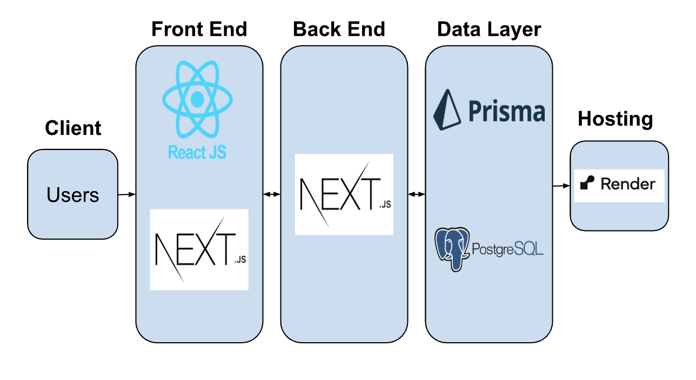

# BU CSC Hours Tracker

Throughout  2024, our team has been developing BU CSC Hours Tracker. Its mission is to connect BU students with nonprofit organizations.

## **Description**

BU CSC Hours Tracker is an application designed to connect BU students with nonprofit organizations looking for volunteers and record the data related to hours volunteered by the individual, organization, college, and university.

It aims to address streamlining the volunteering process by providing a platform for students to connect with non-profits and volunteering opportunities, providing background checks and forms, as well as documenting students’ completed hours.

## **Key Features**

* **Student Volunteers**: Students can track their event applications, volunteer hours, submit forms, browse volunteering events, and apply/waitlist for events.  
* **Administrators**: Admins can approve volunteer hours, approve events, and receive forms.  
* **Third-party**: Third-party organizations can submit/manage events, approve/verify hours, manage organization information, and upload forms.

---

## **Technical Architecture**

<!-- link the image from the public folder -->


### Tech Stack

* Frontend: Next.js  
* Backend: Next.js, Docker  
* Database: Prisma, PostgreSQL  
* Deployment: Render.com ([https://se-bu-csc-hours-tracking.onrender.com/](https://se-bu-csc-hours-tracking.onrender.com/))  
  * Render.com was used to easily provide the client with a navigable demo; it is not necessarily ideal for the final app  
* Other: Clerk (for user authentication)

---

## **Getting Started**

### Prerequisites

Before starting, ensure the following are installed:

* Node  
* Docker

Optional

* pgAdmin (or any postgres database client)

Also make sure to have a .env file with secrets from the Project Description Google doc. Place it in /client.

### **Running the Application Locally**

1. Change to the root directory of the project
`cd client`

2. Install the dependencies
`npm install`

3. Migrate any changes to the database
`npx prisma migrate deploy`

4. View the database in Prisma Studio (optional)
`npx prisma studio`

5. Run the Next.js development server
`npm run dev`

## **Signing in using different views**

After signing in for the first time, you will have an account created (gmails will be considered third praty users and bu emails will be considered student volunteers). Currently, the only way to change the type of user your are is to directly modify the database. Here are some sql queries you can use to do so and test our the differet views (the middleware will automatically redirect you to the correct view based on your role):

1. **Admin**: Sign in with your bu.edu email using OAuth

Run the following SQL query on the database to make your account an admin:

```sql
UPDATE "Person"
SET role = 'ADMIN'
WHERE email = 'your-email-address'
```

2. **Student Volunteer**: Sign in with your bu.edu email using OAuth

```sql
UPDATE "Person"
SET role = 'USER'
WHERE email = 'your-email-address'
```

3. **Third-party**: Sign in with your Google email using OAuth

```sql
UPDATE "Person"
SET role = 'ORGANIZER', affiliation_id = 17, name = 'insert-your-name'
WHERE email = 'your-email-address'
```

---

## **Directory Structure**

```
se-bu-csc-hours-tracking/    
├── client/    
│   └── .next/  
│   └── node\_modules/  
│   └── public/: public assets  
│   └── src/: source code  
│        └── \_common/: common styles for the application  
│        └── app/: core Next.js app using the app router  
│        │  └── \_utils: utility functions  
│        │  └── (admin)/admin: administrator view  
│        │  └── (third-party)/third-party: third party organization view  
│        │  └── (user)/user: student volunteer view  
│        │  └── api/: API routes  
│        │  └── auth/sso-callback/page.tsx: post-authentication routing page  
│        │  └── login/page.tsx: login page  
│        │  └── unauthorized/page.tsx: redirect for unauthorized users     
│        │  └── welcome/page.tsx: welcome page  
│        └── components/: common application components  
│        └── interfaces/interfaces.ts: Typescript interfaces  
│        └── lib/: library of common functions  
│        └── prisma/: database schema and migrations  
│        └── middleware.ts: redirects different users to different pages    
│   └── .env: secrets and environment variables (located in the PD)  
├──README.md    
├──/netlify: Serverless function for sending emails  
├──/prisma: Database access for netlify serverless functions  
```

## **Known Bugs and Issues**

* There is no Netlify account, so the email reminders aren’t deployed and therefore aren’t active

---

## **Future Work**

* Third-party settings page uploading forms to google cloud for storage. Use S3 buckets  
* Admin management of last minute registrations and capability to get off the waitlist  
* Dual-use accounts where users can be volunteers as well as third party organizers  
* Confirmation and reminder emails for event and waitlist registrations with calendar invites  
* Third party collaboration mechanism for third party users to collaborate on volunteer events  
* See more details on the [notion product backlog](https://www.notion.so/fffa3b1ea9418147ab49e2582f3077d8?v=fffa3b1ea9418102a0b5000c75102abe&pvs=4)

---

## **Team (Fall 2024\)**

* Jasper Hoong \- <jasperh@bu.edu>  
* Alexander Miller \- <alexjmil@bu.edu>  
* Thomas Nguyen \- <nguyen04@bu.edu>  
* Jeffrey Zhou \- [jzhou25@bu.edu](mailto:jzhou25@bu.edu)

**Past Contributors**

* Owen Mariani (owenm-26)  
* Alessandra Lanz (alessandralanz)
